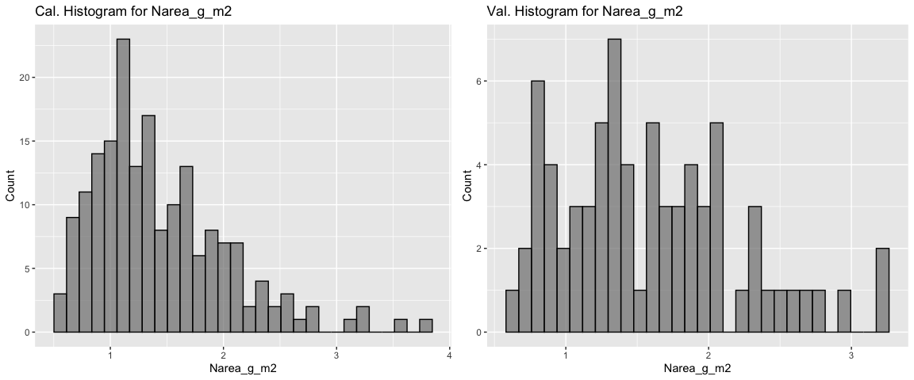
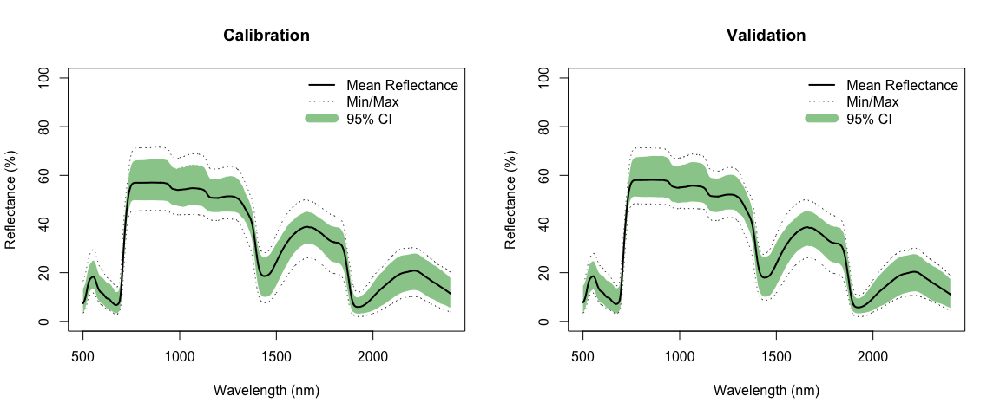
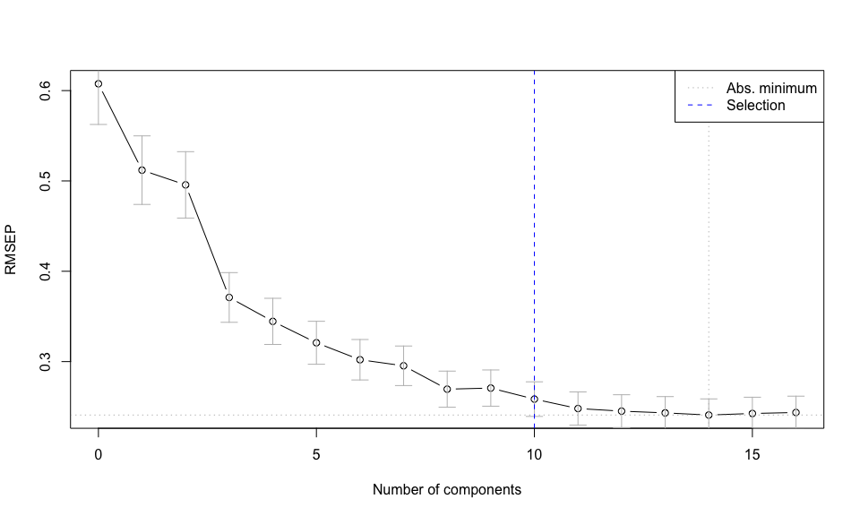
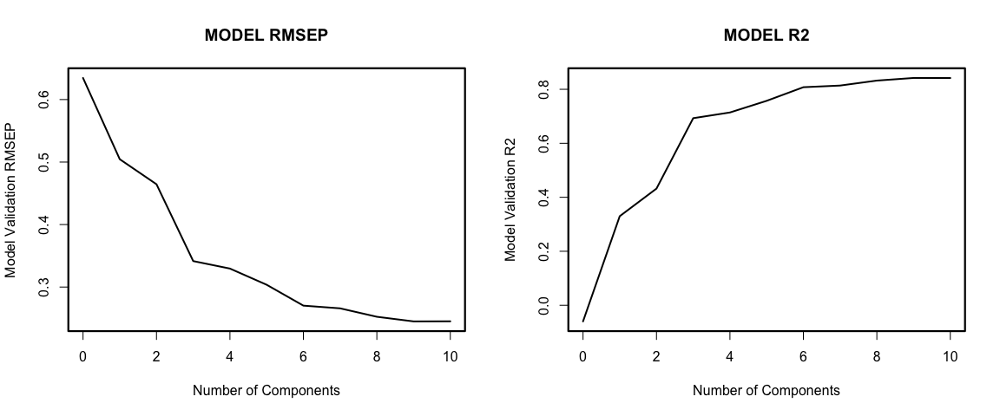
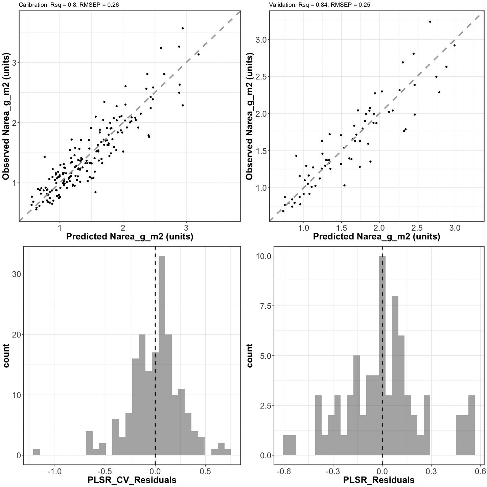
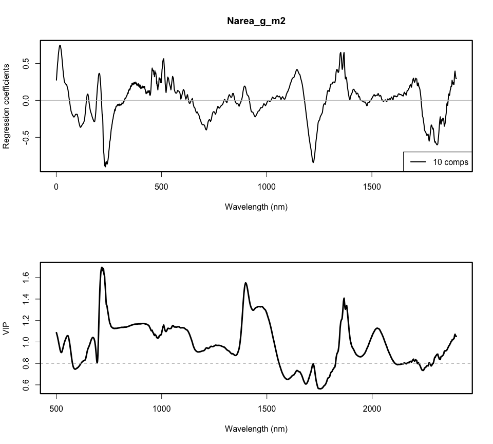
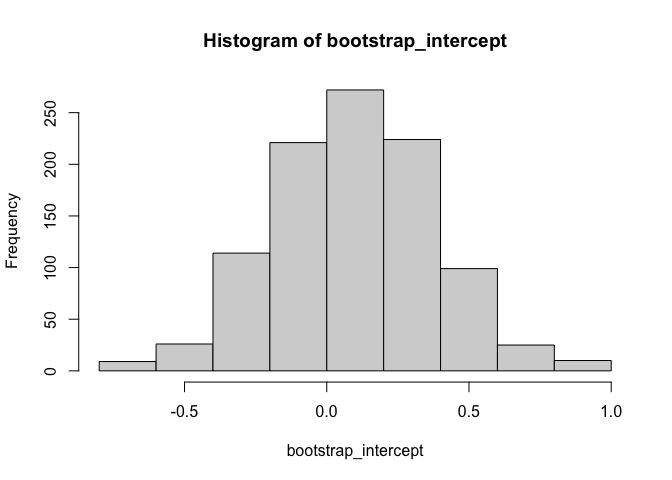
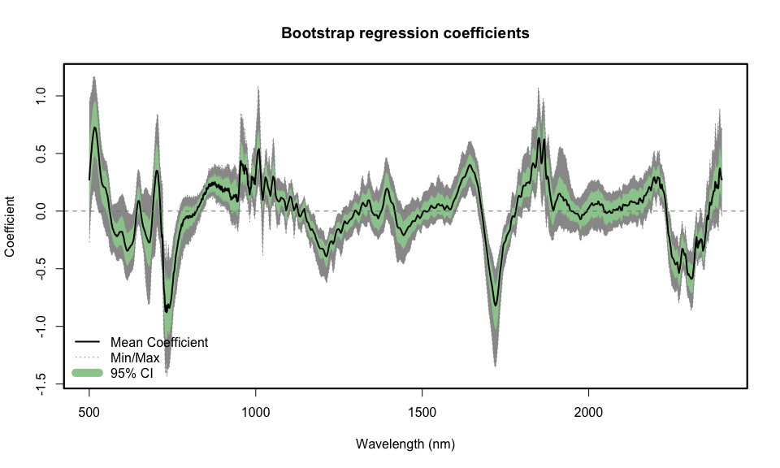
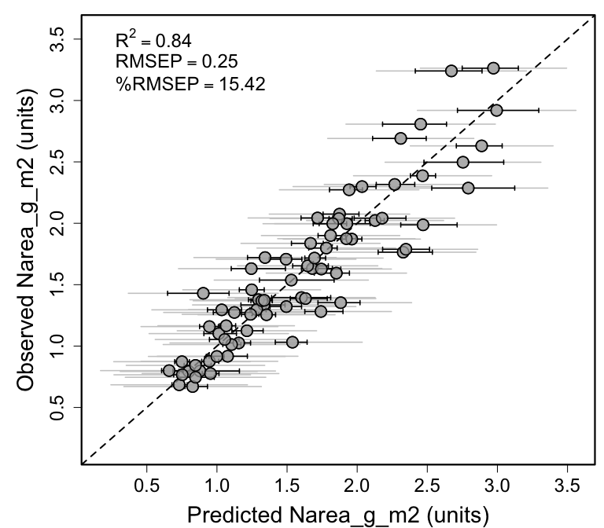

Spectra-trait PLSR example using leaf-level spectra and leaf nitrogen
content (Narea, g/m2) data from 36 species growing in Rosa rugosa
invaded coastal grassland communities in Belgium
================
Shawn P. Serbin, Julien Lamour, & Jeremiah Anderson

### Overview

This is an [R Markdown](http://rmarkdown.rstudio.com) Notebook to
illustrate how to retrieve a dataset from the EcoSIS spectral database,
choose the “optimal” number of plsr components, and fit a plsr model for
leaf nitrogen content (Narea, g/m2)

### Getting Started

### Installation

    ## Loading required package: usethis

    ## 
    ## Attaching package: 'remotes'

    ## The following objects are masked from 'package:devtools':
    ## 
    ##     dev_package_deps, install_bioc, install_bitbucket, install_cran,
    ##     install_deps, install_dev, install_git, install_github,
    ##     install_gitlab, install_local, install_svn, install_url,
    ##     install_version, update_packages

    ## The following object is masked from 'package:usethis':
    ## 
    ##     git_credentials

    ## 
    ## Attaching package: 'pls'

    ## The following object is masked from 'package:stats':
    ## 
    ##     loadings

    ## 
    ## Attaching package: 'dplyr'

    ## The following objects are masked from 'package:stats':
    ## 
    ##     filter, lag

    ## The following objects are masked from 'package:base':
    ## 
    ##     intersect, setdiff, setequal, union

    ## here() starts at /Users/sserbin/Data/GitHub/PLSR_for_plant_trait_prediction

    ## 
    ## Attaching package: 'gridExtra'

    ## The following object is masked from 'package:dplyr':
    ## 
    ##     combine

### Setup other functions and options

``` r
### Setup other functions and options
github_dir <- file.path(here::here(),"R_Scripts")
source_from_gh <- TRUE
if (source_from_gh) {
  # Source helper functions from GitHub
  print("*** GitHub hash of functions.R file:")
  devtools::source_url("https://raw.githubusercontent.com/TESTgroup-BNL/PLSR_for_plant_trait_prediction/master/R_Scripts/functions.R")
} else {
  functions <- file.path(github_dir,"functions.R")
  source(functions)
}
```

    ## [1] "*** GitHub hash of functions.R file:"

    ## SHA-1 hash of file is ce905138c9cd8a7cc443cfcec91adc8cc16eb060

``` r
# not in
`%notin%` <- Negate(`%in%`)

# Script options
pls::pls.options(plsralg = "oscorespls")
pls::pls.options("plsralg")
```

    ## $plsralg
    ## [1] "oscorespls"

``` r
# Default par options
opar <- par(no.readonly = T)

# What is the target variable?
inVar <- "Narea_g_m2"

# What is the source dataset from EcoSIS?
ecosis_id <- "9db4c5a2-7eac-4e1e-8859-009233648e89"

# Specify output directory, output_dir 
# Options: 
# tempdir - use a OS-specified temporary directory 
# user defined PATH - e.g. "~/scratch/PLSR"
output_dir <- "tempdir"
```

### Set working directory (scratch space)

    ## [1] "/private/var/folders/xp/h3k9vf3n2jx181ts786_yjrn9c2gjq/T/Rtmp4uBLiH"

### Grab data from EcoSIS

``` r
print(paste0("Output directory: ",getwd()))  # check wd
```

    ## [1] "Output directory: /Users/sserbin/Data/GitHub/PLSR_for_plant_trait_prediction/vignettes"

``` r
dat_raw <- get_ecosis_data(ecosis_id = ecosis_id)
```

    ## [1] "**** Downloading Ecosis data ****"

    ## Downloading data...

    ## 
    ## ── Column specification ────────────────────────────────────────────────────────
    ## cols(
    ##   .default = col_double(),
    ##   `Latin Species` = col_character(),
    ##   ids = col_character(),
    ##   `plot code` = col_character(),
    ##   `species code` = col_character()
    ## )
    ## ℹ Use `spec()` for the full column specifications.

    ## Download complete!

``` r
head(dat_raw)
```

    ## # A tibble: 6 x 2,164
    ##   `Cw/EWT (cm3/cm… `Latin Species` `Leaf area (mm2… `Leaf calcium c…
    ##              <dbl> <chr>                      <dbl>            <dbl>
    ## 1          0.00887 Arrhenatherum …             696.           0.0291
    ## 2          0.00824 Bromus sterilis             447.           0.0230
    ## 3          0.0280  Jacobaea vulga…            2418.           0.0950
    ## 4          0.0106  Rubus caesius              5719.           0.0700
    ## 5          0.00851 Arrhenatherum …             671.           0.0286
    ## 6          0.0153  Crepis capilla…            1401.           0.0470
    ## # … with 2,160 more variables: `Leaf magnesium content per leaf area
    ## #   (mg/mm2)` <dbl>, `Leaf mass per area (g/cm2)` <dbl>, `Leaf nitrogen content
    ## #   per leaf area (mg/mm2)` <dbl>, `Leaf phosphorus content per leaf area
    ## #   (mg/mm2)` <dbl>, `Leaf potassium content per leaf area (mg/mm2)` <dbl>,
    ## #   `Plant height vegetative (cm)` <dbl>, ids <chr>, `plot code` <chr>,
    ## #   `species code` <chr>, `350` <dbl>, `351` <dbl>, `352` <dbl>, `353` <dbl>,
    ## #   `354` <dbl>, `355` <dbl>, `356` <dbl>, `357` <dbl>, `358` <dbl>,
    ## #   `359` <dbl>, `360` <dbl>, `361` <dbl>, `362` <dbl>, `363` <dbl>,
    ## #   `364` <dbl>, `365` <dbl>, `366` <dbl>, `367` <dbl>, `368` <dbl>,
    ## #   `369` <dbl>, `370` <dbl>, `371` <dbl>, `372` <dbl>, `373` <dbl>,
    ## #   `374` <dbl>, `375` <dbl>, `376` <dbl>, `377` <dbl>, `378` <dbl>,
    ## #   `379` <dbl>, `380` <dbl>, `381` <dbl>, `382` <dbl>, `383` <dbl>,
    ## #   `384` <dbl>, `385` <dbl>, `386` <dbl>, `387` <dbl>, `388` <dbl>,
    ## #   `389` <dbl>, `390` <dbl>, `391` <dbl>, `392` <dbl>, `393` <dbl>,
    ## #   `394` <dbl>, `395` <dbl>, `396` <dbl>, `397` <dbl>, `398` <dbl>,
    ## #   `399` <dbl>, `400` <dbl>, `401` <dbl>, `402` <dbl>, `403` <dbl>,
    ## #   `404` <dbl>, `405` <dbl>, `406` <dbl>, `407` <dbl>, `408` <dbl>,
    ## #   `409` <dbl>, `410` <dbl>, `411` <dbl>, `412` <dbl>, `413` <dbl>,
    ## #   `414` <dbl>, `415` <dbl>, `416` <dbl>, `417` <dbl>, `418` <dbl>,
    ## #   `419` <dbl>, `420` <dbl>, `421` <dbl>, `422` <dbl>, `423` <dbl>,
    ## #   `424` <dbl>, `425` <dbl>, `426` <dbl>, `427` <dbl>, `428` <dbl>,
    ## #   `429` <dbl>, `430` <dbl>, `431` <dbl>, `432` <dbl>, `433` <dbl>,
    ## #   `434` <dbl>, `435` <dbl>, `436` <dbl>, `437` <dbl>, `438` <dbl>,
    ## #   `439` <dbl>, `440` <dbl>, …

``` r
names(dat_raw)[1:40]
```

    ##  [1] "Cw/EWT (cm3/cm2)"                              
    ##  [2] "Latin Species"                                 
    ##  [3] "Leaf area (mm2)"                               
    ##  [4] "Leaf calcium content per leaf area (mg/mm2)"   
    ##  [5] "Leaf magnesium content per leaf area (mg/mm2)" 
    ##  [6] "Leaf mass per area (g/cm2)"                    
    ##  [7] "Leaf nitrogen content per leaf area (mg/mm2)"  
    ##  [8] "Leaf phosphorus content per leaf area (mg/mm2)"
    ##  [9] "Leaf potassium content per leaf area (mg/mm2)" 
    ## [10] "Plant height vegetative (cm)"                  
    ## [11] "ids"                                           
    ## [12] "plot code"                                     
    ## [13] "species code"                                  
    ## [14] "350"                                           
    ## [15] "351"                                           
    ## [16] "352"                                           
    ## [17] "353"                                           
    ## [18] "354"                                           
    ## [19] "355"                                           
    ## [20] "356"                                           
    ## [21] "357"                                           
    ## [22] "358"                                           
    ## [23] "359"                                           
    ## [24] "360"                                           
    ## [25] "361"                                           
    ## [26] "362"                                           
    ## [27] "363"                                           
    ## [28] "364"                                           
    ## [29] "365"                                           
    ## [30] "366"                                           
    ## [31] "367"                                           
    ## [32] "368"                                           
    ## [33] "369"                                           
    ## [34] "370"                                           
    ## [35] "371"                                           
    ## [36] "372"                                           
    ## [37] "373"                                           
    ## [38] "374"                                           
    ## [39] "375"                                           
    ## [40] "376"

### Create full plsr dataset

``` r
### Create plsr dataset
Start.wave <- 500
End.wave <- 2400
wv <- seq(Start.wave,End.wave,1)
Spectra <- as.matrix(dat_raw[,names(dat_raw) %in% wv])
colnames(Spectra) <- c(paste0("Wave_",wv))
sample_info <- dat_raw[,names(dat_raw) %notin% seq(350,2500,1)]
head(sample_info)
```

    ## # A tibble: 6 x 13
    ##   `Cw/EWT (cm3/cm… `Latin Species` `Leaf area (mm2… `Leaf calcium c…
    ##              <dbl> <chr>                      <dbl>            <dbl>
    ## 1          0.00887 Arrhenatherum …             696.           0.0291
    ## 2          0.00824 Bromus sterilis             447.           0.0230
    ## 3          0.0280  Jacobaea vulga…            2418.           0.0950
    ## 4          0.0106  Rubus caesius              5719.           0.0700
    ## 5          0.00851 Arrhenatherum …             671.           0.0286
    ## 6          0.0153  Crepis capilla…            1401.           0.0470
    ## # … with 9 more variables: `Leaf magnesium content per leaf area
    ## #   (mg/mm2)` <dbl>, `Leaf mass per area (g/cm2)` <dbl>, `Leaf nitrogen content
    ## #   per leaf area (mg/mm2)` <dbl>, `Leaf phosphorus content per leaf area
    ## #   (mg/mm2)` <dbl>, `Leaf potassium content per leaf area (mg/mm2)` <dbl>,
    ## #   `Plant height vegetative (cm)` <dbl>, ids <chr>, `plot code` <chr>,
    ## #   `species code` <chr>

``` r
sample_info2 <- sample_info %>%
  select(Plant_Species=`Latin Species`,Species_Code=`species code`,Plot=`plot code`,
         Narea_mg_mm2=`Leaf nitrogen content per leaf area (mg/mm2)`)
sample_info2 <- sample_info2 %>%
#  mutate(Narea_g_m2=Narea_mg_mm2*(0.001/1e-6)) # based on orig units should be this but conversion wrong
  mutate(Narea_g_m2=Narea_mg_mm2*100) # this assumes orig units were g/mm2 or mg/cm2
head(sample_info2)
```

    ## # A tibble: 6 x 5
    ##   Plant_Species         Species_Code Plot  Narea_mg_mm2 Narea_g_m2
    ##   <chr>                 <chr>        <chr>        <dbl>      <dbl>
    ## 1 Arrhenatherum elatius Arrela       DC1        0.0126       1.26 
    ## 2 Bromus sterilis       Broste       DC1        0.00682      0.682
    ## 3 Jacobaea vulgaris     Jacvul       DC1        0.0102       1.02 
    ## 4 Rubus caesius         Rubcae       DC1        0.0121       1.21 
    ## 5 Arrhenatherum elatius Arrela       DC2        0.0117       1.17 
    ## 6 Crepis capillaris     Creves       DC2        0.00877      0.877

``` r
plsr_data <- data.frame(sample_info2,Spectra)
rm(sample_info,sample_info2,Spectra)
```

#### Example data cleaning.

``` r
plsr_data <- plsr_data[complete.cases(plsr_data[,names(plsr_data) %in% 
                                                  c(inVar,paste0("Wave_",wv))]),]
```

### Create cal/val datasets

``` r
### Create cal/val datasets
## Make a stratified random sampling in the strata USDA_Species_Code and Domain

method <- "dplyr" #base/dplyr
# base R - a bit slow
# dplyr - much faster
split_data <- create_data_split(approach=method, split_seed=1245565, prop=0.8, 
                                group_variables="Species_Code")
names(split_data)
```

    ## [1] "cal_data" "val_data"

``` r
cal.plsr.data <- split_data$cal_data
head(cal.plsr.data)[1:8]
```

    ##        Plant_Species Species_Code Plot Narea_mg_mm2 Narea_g_m2 Wave_500
    ## 1 Ammophila arenaria       Ammare  ZC3   0.03240495   3.240495 0.130885
    ## 2 Ammophila arenaria       Ammare  MC2   0.02806279   2.806279 0.135785
    ## 3 Ammophila arenaria       Ammare  ZC1   0.02041612   2.041612 0.147665
    ## 4 Ammophila arenaria       Ammare  MC1   0.02426549   2.426549 0.142765
    ## 5 Ammophila arenaria       Ammare  WC3   0.02807281   2.807281 0.151750
    ## 6 Ammophila arenaria       Ammare  WR3   0.02286678   2.286678 0.150850
    ##   Wave_501 Wave_502
    ## 1  0.13175 0.132750
    ## 2  0.13685 0.138150
    ## 3  0.14910 0.150330
    ## 4  0.14390 0.145200
    ## 5  0.15275 0.154150
    ## 6  0.15185 0.152815

``` r
val.plsr.data <- split_data$val_data
head(val.plsr.data)[1:8]
```

    ##          Plant_Species Species_Code Plot Narea_mg_mm2 Narea_g_m2   Wave_500
    ## 184  Jacobaea vulgaris       Jacvul  WC2  0.008756996  0.8756996 0.06736887
    ## 185 Potentilla reptans       Potrep  WC2  0.010313464  1.0313464 0.07125000
    ## 186      Rubus caesius       Rubcae  WC2  0.007968454  0.7968454 0.05993560
    ## 187      Urtica dioica       Urtdio  WC2  0.012737560  1.2737560 0.06508300
    ## 188 Ammophila arenaria       Ammare  WC3  0.028072806  2.8072806 0.15175000
    ## 189  Jacobaea vulgaris       Jacvul  WC3  0.010251687  1.0251687 0.06805547
    ##       Wave_501   Wave_502
    ## 184 0.06870667 0.07014220
    ## 185 0.07235000 0.07368350
    ## 186 0.06162000 0.06352233
    ## 187 0.06625000 0.06758350
    ## 188 0.15275000 0.15415000
    ## 189 0.06938000 0.07093553

``` r
rm(split_data)

# Datasets:
print(paste("Cal observations: ",dim(cal.plsr.data)[1],sep=""))
```

    ## [1] "Cal observations: 183"

``` r
print(paste("Val observations: ",dim(val.plsr.data)[1],sep=""))
```

    ## [1] "Val observations: 73"

``` r
cal_hist_plot <- qplot(cal.plsr.data[,paste0(inVar)],geom="histogram",
                       main = paste0("Cal. Histogram for ",inVar),
                       xlab = paste0(inVar),ylab = "Count",fill=I("grey50"),col=I("black"),
                       alpha=I(.7))
val_hist_plot <- qplot(val.plsr.data[,paste0(inVar)],geom="histogram",
                       main = paste0("Val. Histogram for ",inVar),
                       xlab = paste0(inVar),ylab = "Count",fill=I("grey50"),col=I("black"),
                       alpha=I(.7))
histograms <- grid.arrange(cal_hist_plot, val_hist_plot, ncol=2)
```

    ## `stat_bin()` using `bins = 30`. Pick better value with `binwidth`.
    ## `stat_bin()` using `bins = 30`. Pick better value with `binwidth`.

<!-- -->

``` r
ggsave(filename = file.path(outdir,paste0(inVar,"_Cal_Val_Histograms.png")), plot = histograms, 
       device="png", width = 30, 
       height = 12, units = "cm",
       dpi = 300)
# output cal/val data
write.csv(cal.plsr.data,file=file.path(outdir,paste0(inVar,'_Cal_PLSR_Dataset.csv')),
          row.names=FALSE)
write.csv(val.plsr.data,file=file.path(outdir,paste0(inVar,'_Val_PLSR_Dataset.csv')),
          row.names=FALSE)
```

### Create calibration and validation PLSR datasets

``` r
### Format PLSR data for model fitting 
cal_spec <- as.matrix(cal.plsr.data[, which(names(cal.plsr.data) %in% paste0("Wave_",wv))])
cal.plsr.data <- data.frame(cal.plsr.data[, which(names(cal.plsr.data) %notin% paste0("Wave_",wv))],
                            Spectra=I(cal_spec))
head(cal.plsr.data)[1:5]
```

    ##        Plant_Species Species_Code Plot Narea_mg_mm2 Narea_g_m2
    ## 1 Ammophila arenaria       Ammare  ZC3   0.03240495   3.240495
    ## 2 Ammophila arenaria       Ammare  MC2   0.02806279   2.806279
    ## 3 Ammophila arenaria       Ammare  ZC1   0.02041612   2.041612
    ## 4 Ammophila arenaria       Ammare  MC1   0.02426549   2.426549
    ## 5 Ammophila arenaria       Ammare  WC3   0.02807281   2.807281
    ## 6 Ammophila arenaria       Ammare  WR3   0.02286678   2.286678

``` r
val_spec <- as.matrix(val.plsr.data[, which(names(val.plsr.data) %in% paste0("Wave_",wv))])
val.plsr.data <- data.frame(val.plsr.data[, which(names(val.plsr.data) %notin% paste0("Wave_",wv))],
                            Spectra=I(val_spec))
head(val.plsr.data)[1:5]
```

    ##          Plant_Species Species_Code Plot Narea_mg_mm2 Narea_g_m2
    ## 184  Jacobaea vulgaris       Jacvul  WC2  0.008756996  0.8756996
    ## 185 Potentilla reptans       Potrep  WC2  0.010313464  1.0313464
    ## 186      Rubus caesius       Rubcae  WC2  0.007968454  0.7968454
    ## 187      Urtica dioica       Urtdio  WC2  0.012737560  1.2737560
    ## 188 Ammophila arenaria       Ammare  WC3  0.028072806  2.8072806
    ## 189  Jacobaea vulgaris       Jacvul  WC3  0.010251687  1.0251687

### plot cal and val spectra

``` r
par(mfrow=c(1,2)) # B, L, T, R
f.plot.spec(Z=cal.plsr.data$Spectra,wv=seq(Start.wave,End.wave,1),plot_label="Calibration")
f.plot.spec(Z=val.plsr.data$Spectra,wv=seq(Start.wave,End.wave,1),plot_label="Validation")
```

<!-- -->

``` r
dev.copy(png,file.path(outdir,paste0(inVar,'_Cal_Val_Spectra.png')), 
         height=2500,width=4900, res=340)
```

    ## quartz_off_screen 
    ##                 3

``` r
dev.off();
```

    ## quartz_off_screen 
    ##                 2

``` r
par(mfrow=c(1,1))
```

### Use permutation to determine optimal number of components

``` r
### Use permutation to determine the optimal number of components
if(grepl("Windows", sessionInfo()$running)){
  pls.options(parallel = NULL)
} else {
  pls.options(parallel = parallel::detectCores()-1)
}

method <- "pls" #pls, firstPlateau, firstMin
random_seed <- 1245565
seg <- 50
maxComps <- 16
iterations <- 80
prop <- 0.70
if (method=="pls") {
  # pls package approach - faster but estimates more components....
  nComps <- find_optimal_components(method=method, maxComps=maxComps, seg=seg, 
                                    random_seed=random_seed)
  print(paste0("*** Optimal number of components: ", nComps))
} else {
  nComps <- find_optimal_components(dataset=cal.plsr.data, method=method, maxComps=maxComps, 
                                    iterations=iterations, seg=seg, prop=prop, 
                                    random_seed=random_seed)
}
```

    ## [1] "*** Running PLS permutation test ***"

<!-- -->

    ## [1] "*** Optimal number of components: 10"

``` r
dev.copy(png,file.path(outdir,paste0(paste0(inVar,"_PLSR_Component_Selection.png"))), 
         height=2800, width=3400,  res=340)
```

    ## quartz_off_screen 
    ##                 3

``` r
dev.off();
```

    ## quartz_off_screen 
    ##                 2

### Fit final model

``` r
plsr.out <- plsr(as.formula(paste(inVar,"~","Spectra")),scale=FALSE,ncomp=nComps,validation="LOO",
                 trace=FALSE,data=cal.plsr.data)
fit <- plsr.out$fitted.values[,1,nComps]
pls.options(parallel = NULL)

# External validation fit stats
par(mfrow=c(1,2)) # B, L, T, R
RMSEP(plsr.out, newdata = val.plsr.data)
```

    ## (Intercept)      1 comps      2 comps      3 comps      4 comps      5 comps  
    ##      0.6346       0.5045       0.4645       0.3415       0.3296       0.3037  
    ##     6 comps      7 comps      8 comps      9 comps     10 comps  
    ##      0.2703       0.2659       0.2524       0.2450       0.2452

``` r
plot(RMSEP(plsr.out,estimate=c("test"),newdata = val.plsr.data), main="MODEL RMSEP",
     xlab="Number of Components",ylab="Model Validation RMSEP",lty=1,col="black",cex=1.5,lwd=2)
box(lwd=2.2)

R2(plsr.out, newdata = val.plsr.data)
```

    ## (Intercept)      1 comps      2 comps      3 comps      4 comps      5 comps  
    ##    -0.05977      0.33000      0.43217      0.69298      0.71415      0.75732  
    ##     6 comps      7 comps      8 comps      9 comps     10 comps  
    ##     0.80776      0.81389      0.83228      0.84198      0.84176

``` r
plot(R2(plsr.out,estimate=c("test"),newdata = val.plsr.data), main="MODEL R2",
     xlab="Number of Components",ylab="Model Validation R2",lty=1,col="black",cex=1.5,lwd=2)
box(lwd=2.2)
```

<!-- -->

``` r
dev.copy(png,file.path(outdir,paste0(paste0(inVar,"_Validation_RMSEP_R2_by_Component.png"))), 
         height=2800, width=4800,  res=340)
```

    ## quartz_off_screen 
    ##                 3

``` r
dev.off();
```

    ## quartz_off_screen 
    ##                 2

``` r
par(opar)
```

### PLSR fit observed vs. predicted plot data

``` r
#calibration
cal.plsr.output <- data.frame(cal.plsr.data[, which(names(cal.plsr.data) %notin% "Spectra")],
                              PLSR_Predicted=fit,
                              PLSR_CV_Predicted=as.vector(plsr.out$validation$pred[,,nComps]))
cal.plsr.output <- cal.plsr.output %>%
  mutate(PLSR_CV_Residuals = PLSR_CV_Predicted-get(inVar))
head(cal.plsr.output)
```

    ##        Plant_Species Species_Code Plot Narea_mg_mm2 Narea_g_m2 PLSR_Predicted
    ## 1 Ammophila arenaria       Ammare  ZC3   0.03240495   3.240495       2.672029
    ## 2 Ammophila arenaria       Ammare  MC2   0.02806279   2.806279       2.651863
    ## 3 Ammophila arenaria       Ammare  ZC1   0.02041612   2.041612       2.178056
    ## 4 Ammophila arenaria       Ammare  MC1   0.02426549   2.426549       2.412013
    ## 5 Ammophila arenaria       Ammare  WC3   0.02807281   2.807281       2.452711
    ## 6 Ammophila arenaria       Ammare  WR3   0.02286678   2.286678       2.792340
    ##   PLSR_CV_Predicted PLSR_CV_Residuals
    ## 1          2.598245      -0.642250440
    ## 2          2.652066      -0.154212969
    ## 3          2.200588       0.158975634
    ## 4          2.435784       0.009234491
    ## 5          2.384049      -0.423231444
    ## 6          2.943186       0.656508493

``` r
cal.R2 <- round(pls::R2(plsr.out)[[1]][nComps],2)
cal.RMSEP <- round(sqrt(mean(cal.plsr.output$PLSR_CV_Residuals^2)),2)

val.plsr.output <- data.frame(val.plsr.data[, which(names(val.plsr.data) %notin% "Spectra")],
                              PLSR_Predicted=as.vector(predict(plsr.out, 
                                                               newdata = val.plsr.data, 
                                                               ncomp=nComps, type="response")[,,1]))
val.plsr.output <- val.plsr.output %>%
  mutate(PLSR_Residuals = PLSR_Predicted-get(inVar))
head(val.plsr.output)
```

    ##        Plant_Species Species_Code Plot Narea_mg_mm2 Narea_g_m2 PLSR_Predicted
    ## 1  Jacobaea vulgaris       Jacvul  WC2  0.008756996  0.8756996      0.9462916
    ## 2 Potentilla reptans       Potrep  WC2  0.010313464  1.0313464      1.5386676
    ## 3      Rubus caesius       Rubcae  WC2  0.007968454  0.7968454      0.8790482
    ## 4      Urtica dioica       Urtdio  WC2  0.012737560  1.2737560      1.1241560
    ## 5 Ammophila arenaria       Ammare  WC3  0.028072806  2.8072806      2.4527108
    ## 6  Jacobaea vulgaris       Jacvul  WC3  0.010251687  1.0251687      1.1553688
    ##   PLSR_Residuals
    ## 1     0.07059201
    ## 2     0.50732119
    ## 3     0.08220284
    ## 4    -0.14959995
    ## 5    -0.35456980
    ## 6     0.13020008

``` r
val.R2 <- round(pls::R2(plsr.out,newdata=val.plsr.data)[[1]][nComps],2)
val.RMSEP <- round(sqrt(mean(val.plsr.output$PLSR_Residuals^2)),2)

rng_quant <- quantile(cal.plsr.output[,inVar], probs = c(0.001, 0.999))
cal_scatter_plot <- ggplot(cal.plsr.output, aes(x=PLSR_CV_Predicted, y=get(inVar))) + 
  theme_bw() + geom_point() + geom_abline(intercept = 0, slope = 1, color="dark grey", 
                                          linetype="dashed", size=1.5) + xlim(rng_quant[1], 
                                                                              rng_quant[2]) + 
  ylim(rng_quant[1], rng_quant[2]) +
  labs(x=paste0("Predicted ", paste(inVar), " (units)"),
       y=paste0("Observed ", paste(inVar), " (units)"),
       title=paste0("Calibration: ", paste0("Rsq = ", cal.R2), "; ", paste0("RMSEP = ", 
                                                                            cal.RMSEP))) +
  theme(axis.text=element_text(size=18), legend.position="none",
        axis.title=element_text(size=20, face="bold"), 
        axis.text.x = element_text(angle = 0,vjust = 0.5),
        panel.border = element_rect(linetype = "solid", fill = NA, size=1.5))

cal_resid_histogram <- ggplot(cal.plsr.output, aes(x=PLSR_CV_Residuals)) +
  geom_histogram(alpha=.5, position="identity") + 
  geom_vline(xintercept = 0, color="black", 
             linetype="dashed", size=1) + theme_bw() + 
  theme(axis.text=element_text(size=18), legend.position="none",
        axis.title=element_text(size=20, face="bold"), 
        axis.text.x = element_text(angle = 0,vjust = 0.5),
        panel.border = element_rect(linetype = "solid", fill = NA, size=1.5))

rng_quant <- quantile(val.plsr.output[,inVar], probs = c(0.001, 0.999))
val_scatter_plot <- ggplot(val.plsr.output, aes(x=PLSR_Predicted, y=get(inVar))) + 
  theme_bw() + geom_point() + geom_abline(intercept = 0, slope = 1, color="dark grey", 
                                          linetype="dashed", size=1.5) + xlim(rng_quant[1], 
                                                                              rng_quant[2]) + 
  ylim(rng_quant[1], rng_quant[2]) +
  labs(x=paste0("Predicted ", paste(inVar), " (units)"),
       y=paste0("Observed ", paste(inVar), " (units)"),
       title=paste0("Validation: ", paste0("Rsq = ", val.R2), "; ", paste0("RMSEP = ", 
                                                                           val.RMSEP))) +
  theme(axis.text=element_text(size=18), legend.position="none",
        axis.title=element_text(size=20, face="bold"), 
        axis.text.x = element_text(angle = 0,vjust = 0.5),
        panel.border = element_rect(linetype = "solid", fill = NA, size=1.5))

val_resid_histogram <- ggplot(val.plsr.output, aes(x=PLSR_Residuals)) +
  geom_histogram(alpha=.5, position="identity") + 
  geom_vline(xintercept = 0, color="black", 
             linetype="dashed", size=1) + theme_bw() + 
  theme(axis.text=element_text(size=18), legend.position="none",
        axis.title=element_text(size=20, face="bold"), 
        axis.text.x = element_text(angle = 0,vjust = 0.5),
        panel.border = element_rect(linetype = "solid", fill = NA, size=1.5))

# plot cal/val side-by-side
scatterplots <- grid.arrange(cal_scatter_plot, val_scatter_plot, cal_resid_histogram, 
                             val_resid_histogram, nrow=2,ncol=2)
```

    ## Warning: Removed 2 rows containing missing values (geom_point).

    ## Warning: Removed 3 rows containing missing values (geom_point).

    ## `stat_bin()` using `bins = 30`. Pick better value with `binwidth`.
    ## `stat_bin()` using `bins = 30`. Pick better value with `binwidth`.

<!-- -->

``` r
ggsave(filename = file.path(outdir,paste0(inVar,"_Cal_Val_Scatterplots.png")), 
       plot = scatterplots, device="png", 
       width = 32, 
       height = 30, units = "cm",
       dpi = 300)
```

### Generate Coefficient and VIP plots

``` r
vips <- VIP(plsr.out)[nComps,]
par(mfrow=c(2,1))
plot(plsr.out, plottype = "coef",xlab="Wavelength (nm)",
     ylab="Regression coefficients",legendpos = "bottomright",
     ncomp=nComps,lwd=2)
box(lwd=2.2)
plot(seq(Start.wave,End.wave,1),vips,xlab="Wavelength (nm)",ylab="VIP",cex=0.01)
lines(seq(Start.wave,End.wave,1),vips,lwd=3)
abline(h=0.8,lty=2,col="dark grey")
box(lwd=2.2)
```

<!-- -->

``` r
dev.copy(png,file.path(outdir,paste0(inVar,'_Coefficient_VIP_plot.png')), 
         height=3100, width=4100, res=340)
```

    ## quartz_off_screen 
    ##                 3

``` r
dev.off();
```

    ## quartz_off_screen 
    ##                 2

### Bootstrap validation

``` r
if(grepl("Windows", sessionInfo()$running)){
  pls.options(parallel =NULL)
} else {
  pls.options(parallel = parallel::detectCores()-1)
}

### PLSR bootstrap permutation uncertainty analysis
iterations <- 1000    # how many permutation iterations to run
prop <- 0.70          # fraction of training data to keep for each iteration
plsr_permutation <- pls_permutation(dataset=cal.plsr.data, maxComps=nComps, iterations=iterations, prop=prop)
```

    ## [1] "*** Running permutation test.  Please hang tight, this can take awhile ***"
    ## [1] "Options: 10 1000 100 0.7"

    ## Running interation 1

    ## Running interation 2

    ## Running interation 3

    ## Running interation 4

    ## Running interation 5

    ## Running interation 6

    ## Running interation 7

    ## Running interation 8

    ## Running interation 9

    ## Running interation 10

    ## Running interation 11

    ## Running interation 12

    ## Running interation 13

    ## Running interation 14

    ## Running interation 15

    ## Running interation 16

    ## Running interation 17

    ## Running interation 18

    ## Running interation 19

    ## Running interation 20

    ## Running interation 21

    ## Running interation 22

    ## Running interation 23

    ## Running interation 24

    ## Running interation 25

    ## Running interation 26

    ## Running interation 27

    ## Running interation 28

    ## Running interation 29

    ## Running interation 30

    ## Running interation 31

    ## Running interation 32

    ## Running interation 33

    ## Running interation 34

    ## Running interation 35

    ## Running interation 36

    ## Running interation 37

    ## Running interation 38

    ## Running interation 39

    ## Running interation 40

    ## Running interation 41

    ## Running interation 42

    ## Running interation 43

    ## Running interation 44

    ## Running interation 45

    ## Running interation 46

    ## Running interation 47

    ## Running interation 48

    ## Running interation 49

    ## Running interation 50

    ## Running interation 51

    ## Running interation 52

    ## Running interation 53

    ## Running interation 54

    ## Running interation 55

    ## Running interation 56

    ## Running interation 57

    ## Running interation 58

    ## Running interation 59

    ## Running interation 60

    ## Running interation 61

    ## Running interation 62

    ## Running interation 63

    ## Running interation 64

    ## Running interation 65

    ## Running interation 66

    ## Running interation 67

    ## Running interation 68

    ## Running interation 69

    ## Running interation 70

    ## Running interation 71

    ## Running interation 72

    ## Running interation 73

    ## Running interation 74

    ## Running interation 75

    ## Running interation 76

    ## Running interation 77

    ## Running interation 78

    ## Running interation 79

    ## Running interation 80

    ## Running interation 81

    ## Running interation 82

    ## Running interation 83

    ## Running interation 84

    ## Running interation 85

    ## Running interation 86

    ## Running interation 87

    ## Running interation 88

    ## Running interation 89

    ## Running interation 90

    ## Running interation 91

    ## Running interation 92

    ## Running interation 93

    ## Running interation 94

    ## Running interation 95

    ## Running interation 96

    ## Running interation 97

    ## Running interation 98

    ## Running interation 99

    ## Running interation 100

    ## Running interation 101

    ## Running interation 102

    ## Running interation 103

    ## Running interation 104

    ## Running interation 105

    ## Running interation 106

    ## Running interation 107

    ## Running interation 108

    ## Running interation 109

    ## Running interation 110

    ## Running interation 111

    ## Running interation 112

    ## Running interation 113

    ## Running interation 114

    ## Running interation 115

    ## Running interation 116

    ## Running interation 117

    ## Running interation 118

    ## Running interation 119

    ## Running interation 120

    ## Running interation 121

    ## Running interation 122

    ## Running interation 123

    ## Running interation 124

    ## Running interation 125

    ## Running interation 126

    ## Running interation 127

    ## Running interation 128

    ## Running interation 129

    ## Running interation 130

    ## Running interation 131

    ## Running interation 132

    ## Running interation 133

    ## Running interation 134

    ## Running interation 135

    ## Running interation 136

    ## Running interation 137

    ## Running interation 138

    ## Running interation 139

    ## Running interation 140

    ## Running interation 141

    ## Running interation 142

    ## Running interation 143

    ## Running interation 144

    ## Running interation 145

    ## Running interation 146

    ## Running interation 147

    ## Running interation 148

    ## Running interation 149

    ## Running interation 150

    ## Running interation 151

    ## Running interation 152

    ## Running interation 153

    ## Running interation 154

    ## Running interation 155

    ## Running interation 156

    ## Running interation 157

    ## Running interation 158

    ## Running interation 159

    ## Running interation 160

    ## Running interation 161

    ## Running interation 162

    ## Running interation 163

    ## Running interation 164

    ## Running interation 165

    ## Running interation 166

    ## Running interation 167

    ## Running interation 168

    ## Running interation 169

    ## Running interation 170

    ## Running interation 171

    ## Running interation 172

    ## Running interation 173

    ## Running interation 174

    ## Running interation 175

    ## Running interation 176

    ## Running interation 177

    ## Running interation 178

    ## Running interation 179

    ## Running interation 180

    ## Running interation 181

    ## Running interation 182

    ## Running interation 183

    ## Running interation 184

    ## Running interation 185

    ## Running interation 186

    ## Running interation 187

    ## Running interation 188

    ## Running interation 189

    ## Running interation 190

    ## Running interation 191

    ## Running interation 192

    ## Running interation 193

    ## Running interation 194

    ## Running interation 195

    ## Running interation 196

    ## Running interation 197

    ## Running interation 198

    ## Running interation 199

    ## Running interation 200

    ## Running interation 201

    ## Running interation 202

    ## Running interation 203

    ## Running interation 204

    ## Running interation 205

    ## Running interation 206

    ## Running interation 207

    ## Running interation 208

    ## Running interation 209

    ## Running interation 210

    ## Running interation 211

    ## Running interation 212

    ## Running interation 213

    ## Running interation 214

    ## Running interation 215

    ## Running interation 216

    ## Running interation 217

    ## Running interation 218

    ## Running interation 219

    ## Running interation 220

    ## Running interation 221

    ## Running interation 222

    ## Running interation 223

    ## Running interation 224

    ## Running interation 225

    ## Running interation 226

    ## Running interation 227

    ## Running interation 228

    ## Running interation 229

    ## Running interation 230

    ## Running interation 231

    ## Running interation 232

    ## Running interation 233

    ## Running interation 234

    ## Running interation 235

    ## Running interation 236

    ## Running interation 237

    ## Running interation 238

    ## Running interation 239

    ## Running interation 240

    ## Running interation 241

    ## Running interation 242

    ## Running interation 243

    ## Running interation 244

    ## Running interation 245

    ## Running interation 246

    ## Running interation 247

    ## Running interation 248

    ## Running interation 249

    ## Running interation 250

    ## Running interation 251

    ## Running interation 252

    ## Running interation 253

    ## Running interation 254

    ## Running interation 255

    ## Running interation 256

    ## Running interation 257

    ## Running interation 258

    ## Running interation 259

    ## Running interation 260

    ## Running interation 261

    ## Running interation 262

    ## Running interation 263

    ## Running interation 264

    ## Running interation 265

    ## Running interation 266

    ## Running interation 267

    ## Running interation 268

    ## Running interation 269

    ## Running interation 270

    ## Running interation 271

    ## Running interation 272

    ## Running interation 273

    ## Running interation 274

    ## Running interation 275

    ## Running interation 276

    ## Running interation 277

    ## Running interation 278

    ## Running interation 279

    ## Running interation 280

    ## Running interation 281

    ## Running interation 282

    ## Running interation 283

    ## Running interation 284

    ## Running interation 285

    ## Running interation 286

    ## Running interation 287

    ## Running interation 288

    ## Running interation 289

    ## Running interation 290

    ## Running interation 291

    ## Running interation 292

    ## Running interation 293

    ## Running interation 294

    ## Running interation 295

    ## Running interation 296

    ## Running interation 297

    ## Running interation 298

    ## Running interation 299

    ## Running interation 300

    ## Running interation 301

    ## Running interation 302

    ## Running interation 303

    ## Running interation 304

    ## Running interation 305

    ## Running interation 306

    ## Running interation 307

    ## Running interation 308

    ## Running interation 309

    ## Running interation 310

    ## Running interation 311

    ## Running interation 312

    ## Running interation 313

    ## Running interation 314

    ## Running interation 315

    ## Running interation 316

    ## Running interation 317

    ## Running interation 318

    ## Running interation 319

    ## Running interation 320

    ## Running interation 321

    ## Running interation 322

    ## Running interation 323

    ## Running interation 324

    ## Running interation 325

    ## Running interation 326

    ## Running interation 327

    ## Running interation 328

    ## Running interation 329

    ## Running interation 330

    ## Running interation 331

    ## Running interation 332

    ## Running interation 333

    ## Running interation 334

    ## Running interation 335

    ## Running interation 336

    ## Running interation 337

    ## Running interation 338

    ## Running interation 339

    ## Running interation 340

    ## Running interation 341

    ## Running interation 342

    ## Running interation 343

    ## Running interation 344

    ## Running interation 345

    ## Running interation 346

    ## Running interation 347

    ## Running interation 348

    ## Running interation 349

    ## Running interation 350

    ## Running interation 351

    ## Running interation 352

    ## Running interation 353

    ## Running interation 354

    ## Running interation 355

    ## Running interation 356

    ## Running interation 357

    ## Running interation 358

    ## Running interation 359

    ## Running interation 360

    ## Running interation 361

    ## Running interation 362

    ## Running interation 363

    ## Running interation 364

    ## Running interation 365

    ## Running interation 366

    ## Running interation 367

    ## Running interation 368

    ## Running interation 369

    ## Running interation 370

    ## Running interation 371

    ## Running interation 372

    ## Running interation 373

    ## Running interation 374

    ## Running interation 375

    ## Running interation 376

    ## Running interation 377

    ## Running interation 378

    ## Running interation 379

    ## Running interation 380

    ## Running interation 381

    ## Running interation 382

    ## Running interation 383

    ## Running interation 384

    ## Running interation 385

    ## Running interation 386

    ## Running interation 387

    ## Running interation 388

    ## Running interation 389

    ## Running interation 390

    ## Running interation 391

    ## Running interation 392

    ## Running interation 393

    ## Running interation 394

    ## Running interation 395

    ## Running interation 396

    ## Running interation 397

    ## Running interation 398

    ## Running interation 399

    ## Running interation 400

    ## Running interation 401

    ## Running interation 402

    ## Running interation 403

    ## Running interation 404

    ## Running interation 405

    ## Running interation 406

    ## Running interation 407

    ## Running interation 408

    ## Running interation 409

    ## Running interation 410

    ## Running interation 411

    ## Running interation 412

    ## Running interation 413

    ## Running interation 414

    ## Running interation 415

    ## Running interation 416

    ## Running interation 417

    ## Running interation 418

    ## Running interation 419

    ## Running interation 420

    ## Running interation 421

    ## Running interation 422

    ## Running interation 423

    ## Running interation 424

    ## Running interation 425

    ## Running interation 426

    ## Running interation 427

    ## Running interation 428

    ## Running interation 429

    ## Running interation 430

    ## Running interation 431

    ## Running interation 432

    ## Running interation 433

    ## Running interation 434

    ## Running interation 435

    ## Running interation 436

    ## Running interation 437

    ## Running interation 438

    ## Running interation 439

    ## Running interation 440

    ## Running interation 441

    ## Running interation 442

    ## Running interation 443

    ## Running interation 444

    ## Running interation 445

    ## Running interation 446

    ## Running interation 447

    ## Running interation 448

    ## Running interation 449

    ## Running interation 450

    ## Running interation 451

    ## Running interation 452

    ## Running interation 453

    ## Running interation 454

    ## Running interation 455

    ## Running interation 456

    ## Running interation 457

    ## Running interation 458

    ## Running interation 459

    ## Running interation 460

    ## Running interation 461

    ## Running interation 462

    ## Running interation 463

    ## Running interation 464

    ## Running interation 465

    ## Running interation 466

    ## Running interation 467

    ## Running interation 468

    ## Running interation 469

    ## Running interation 470

    ## Running interation 471

    ## Running interation 472

    ## Running interation 473

    ## Running interation 474

    ## Running interation 475

    ## Running interation 476

    ## Running interation 477

    ## Running interation 478

    ## Running interation 479

    ## Running interation 480

    ## Running interation 481

    ## Running interation 482

    ## Running interation 483

    ## Running interation 484

    ## Running interation 485

    ## Running interation 486

    ## Running interation 487

    ## Running interation 488

    ## Running interation 489

    ## Running interation 490

    ## Running interation 491

    ## Running interation 492

    ## Running interation 493

    ## Running interation 494

    ## Running interation 495

    ## Running interation 496

    ## Running interation 497

    ## Running interation 498

    ## Running interation 499

    ## Running interation 500

    ## Running interation 501

    ## Running interation 502

    ## Running interation 503

    ## Running interation 504

    ## Running interation 505

    ## Running interation 506

    ## Running interation 507

    ## Running interation 508

    ## Running interation 509

    ## Running interation 510

    ## Running interation 511

    ## Running interation 512

    ## Running interation 513

    ## Running interation 514

    ## Running interation 515

    ## Running interation 516

    ## Running interation 517

    ## Running interation 518

    ## Running interation 519

    ## Running interation 520

    ## Running interation 521

    ## Running interation 522

    ## Running interation 523

    ## Running interation 524

    ## Running interation 525

    ## Running interation 526

    ## Running interation 527

    ## Running interation 528

    ## Running interation 529

    ## Running interation 530

    ## Running interation 531

    ## Running interation 532

    ## Running interation 533

    ## Running interation 534

    ## Running interation 535

    ## Running interation 536

    ## Running interation 537

    ## Running interation 538

    ## Running interation 539

    ## Running interation 540

    ## Running interation 541

    ## Running interation 542

    ## Running interation 543

    ## Running interation 544

    ## Running interation 545

    ## Running interation 546

    ## Running interation 547

    ## Running interation 548

    ## Running interation 549

    ## Running interation 550

    ## Running interation 551

    ## Running interation 552

    ## Running interation 553

    ## Running interation 554

    ## Running interation 555

    ## Running interation 556

    ## Running interation 557

    ## Running interation 558

    ## Running interation 559

    ## Running interation 560

    ## Running interation 561

    ## Running interation 562

    ## Running interation 563

    ## Running interation 564

    ## Running interation 565

    ## Running interation 566

    ## Running interation 567

    ## Running interation 568

    ## Running interation 569

    ## Running interation 570

    ## Running interation 571

    ## Running interation 572

    ## Running interation 573

    ## Running interation 574

    ## Running interation 575

    ## Running interation 576

    ## Running interation 577

    ## Running interation 578

    ## Running interation 579

    ## Running interation 580

    ## Running interation 581

    ## Running interation 582

    ## Running interation 583

    ## Running interation 584

    ## Running interation 585

    ## Running interation 586

    ## Running interation 587

    ## Running interation 588

    ## Running interation 589

    ## Running interation 590

    ## Running interation 591

    ## Running interation 592

    ## Running interation 593

    ## Running interation 594

    ## Running interation 595

    ## Running interation 596

    ## Running interation 597

    ## Running interation 598

    ## Running interation 599

    ## Running interation 600

    ## Running interation 601

    ## Running interation 602

    ## Running interation 603

    ## Running interation 604

    ## Running interation 605

    ## Running interation 606

    ## Running interation 607

    ## Running interation 608

    ## Running interation 609

    ## Running interation 610

    ## Running interation 611

    ## Running interation 612

    ## Running interation 613

    ## Running interation 614

    ## Running interation 615

    ## Running interation 616

    ## Running interation 617

    ## Running interation 618

    ## Running interation 619

    ## Running interation 620

    ## Running interation 621

    ## Running interation 622

    ## Running interation 623

    ## Running interation 624

    ## Running interation 625

    ## Running interation 626

    ## Running interation 627

    ## Running interation 628

    ## Running interation 629

    ## Running interation 630

    ## Running interation 631

    ## Running interation 632

    ## Running interation 633

    ## Running interation 634

    ## Running interation 635

    ## Running interation 636

    ## Running interation 637

    ## Running interation 638

    ## Running interation 639

    ## Running interation 640

    ## Running interation 641

    ## Running interation 642

    ## Running interation 643

    ## Running interation 644

    ## Running interation 645

    ## Running interation 646

    ## Running interation 647

    ## Running interation 648

    ## Running interation 649

    ## Running interation 650

    ## Running interation 651

    ## Running interation 652

    ## Running interation 653

    ## Running interation 654

    ## Running interation 655

    ## Running interation 656

    ## Running interation 657

    ## Running interation 658

    ## Running interation 659

    ## Running interation 660

    ## Running interation 661

    ## Running interation 662

    ## Running interation 663

    ## Running interation 664

    ## Running interation 665

    ## Running interation 666

    ## Running interation 667

    ## Running interation 668

    ## Running interation 669

    ## Running interation 670

    ## Running interation 671

    ## Running interation 672

    ## Running interation 673

    ## Running interation 674

    ## Running interation 675

    ## Running interation 676

    ## Running interation 677

    ## Running interation 678

    ## Running interation 679

    ## Running interation 680

    ## Running interation 681

    ## Running interation 682

    ## Running interation 683

    ## Running interation 684

    ## Running interation 685

    ## Running interation 686

    ## Running interation 687

    ## Running interation 688

    ## Running interation 689

    ## Running interation 690

    ## Running interation 691

    ## Running interation 692

    ## Running interation 693

    ## Running interation 694

    ## Running interation 695

    ## Running interation 696

    ## Running interation 697

    ## Running interation 698

    ## Running interation 699

    ## Running interation 700

    ## Running interation 701

    ## Running interation 702

    ## Running interation 703

    ## Running interation 704

    ## Running interation 705

    ## Running interation 706

    ## Running interation 707

    ## Running interation 708

    ## Running interation 709

    ## Running interation 710

    ## Running interation 711

    ## Running interation 712

    ## Running interation 713

    ## Running interation 714

    ## Running interation 715

    ## Running interation 716

    ## Running interation 717

    ## Running interation 718

    ## Running interation 719

    ## Running interation 720

    ## Running interation 721

    ## Running interation 722

    ## Running interation 723

    ## Running interation 724

    ## Running interation 725

    ## Running interation 726

    ## Running interation 727

    ## Running interation 728

    ## Running interation 729

    ## Running interation 730

    ## Running interation 731

    ## Running interation 732

    ## Running interation 733

    ## Running interation 734

    ## Running interation 735

    ## Running interation 736

    ## Running interation 737

    ## Running interation 738

    ## Running interation 739

    ## Running interation 740

    ## Running interation 741

    ## Running interation 742

    ## Running interation 743

    ## Running interation 744

    ## Running interation 745

    ## Running interation 746

    ## Running interation 747

    ## Running interation 748

    ## Running interation 749

    ## Running interation 750

    ## Running interation 751

    ## Running interation 752

    ## Running interation 753

    ## Running interation 754

    ## Running interation 755

    ## Running interation 756

    ## Running interation 757

    ## Running interation 758

    ## Running interation 759

    ## Running interation 760

    ## Running interation 761

    ## Running interation 762

    ## Running interation 763

    ## Running interation 764

    ## Running interation 765

    ## Running interation 766

    ## Running interation 767

    ## Running interation 768

    ## Running interation 769

    ## Running interation 770

    ## Running interation 771

    ## Running interation 772

    ## Running interation 773

    ## Running interation 774

    ## Running interation 775

    ## Running interation 776

    ## Running interation 777

    ## Running interation 778

    ## Running interation 779

    ## Running interation 780

    ## Running interation 781

    ## Running interation 782

    ## Running interation 783

    ## Running interation 784

    ## Running interation 785

    ## Running interation 786

    ## Running interation 787

    ## Running interation 788

    ## Running interation 789

    ## Running interation 790

    ## Running interation 791

    ## Running interation 792

    ## Running interation 793

    ## Running interation 794

    ## Running interation 795

    ## Running interation 796

    ## Running interation 797

    ## Running interation 798

    ## Running interation 799

    ## Running interation 800

    ## Running interation 801

    ## Running interation 802

    ## Running interation 803

    ## Running interation 804

    ## Running interation 805

    ## Running interation 806

    ## Running interation 807

    ## Running interation 808

    ## Running interation 809

    ## Running interation 810

    ## Running interation 811

    ## Running interation 812

    ## Running interation 813

    ## Running interation 814

    ## Running interation 815

    ## Running interation 816

    ## Running interation 817

    ## Running interation 818

    ## Running interation 819

    ## Running interation 820

    ## Running interation 821

    ## Running interation 822

    ## Running interation 823

    ## Running interation 824

    ## Running interation 825

    ## Running interation 826

    ## Running interation 827

    ## Running interation 828

    ## Running interation 829

    ## Running interation 830

    ## Running interation 831

    ## Running interation 832

    ## Running interation 833

    ## Running interation 834

    ## Running interation 835

    ## Running interation 836

    ## Running interation 837

    ## Running interation 838

    ## Running interation 839

    ## Running interation 840

    ## Running interation 841

    ## Running interation 842

    ## Running interation 843

    ## Running interation 844

    ## Running interation 845

    ## Running interation 846

    ## Running interation 847

    ## Running interation 848

    ## Running interation 849

    ## Running interation 850

    ## Running interation 851

    ## Running interation 852

    ## Running interation 853

    ## Running interation 854

    ## Running interation 855

    ## Running interation 856

    ## Running interation 857

    ## Running interation 858

    ## Running interation 859

    ## Running interation 860

    ## Running interation 861

    ## Running interation 862

    ## Running interation 863

    ## Running interation 864

    ## Running interation 865

    ## Running interation 866

    ## Running interation 867

    ## Running interation 868

    ## Running interation 869

    ## Running interation 870

    ## Running interation 871

    ## Running interation 872

    ## Running interation 873

    ## Running interation 874

    ## Running interation 875

    ## Running interation 876

    ## Running interation 877

    ## Running interation 878

    ## Running interation 879

    ## Running interation 880

    ## Running interation 881

    ## Running interation 882

    ## Running interation 883

    ## Running interation 884

    ## Running interation 885

    ## Running interation 886

    ## Running interation 887

    ## Running interation 888

    ## Running interation 889

    ## Running interation 890

    ## Running interation 891

    ## Running interation 892

    ## Running interation 893

    ## Running interation 894

    ## Running interation 895

    ## Running interation 896

    ## Running interation 897

    ## Running interation 898

    ## Running interation 899

    ## Running interation 900

    ## Running interation 901

    ## Running interation 902

    ## Running interation 903

    ## Running interation 904

    ## Running interation 905

    ## Running interation 906

    ## Running interation 907

    ## Running interation 908

    ## Running interation 909

    ## Running interation 910

    ## Running interation 911

    ## Running interation 912

    ## Running interation 913

    ## Running interation 914

    ## Running interation 915

    ## Running interation 916

    ## Running interation 917

    ## Running interation 918

    ## Running interation 919

    ## Running interation 920

    ## Running interation 921

    ## Running interation 922

    ## Running interation 923

    ## Running interation 924

    ## Running interation 925

    ## Running interation 926

    ## Running interation 927

    ## Running interation 928

    ## Running interation 929

    ## Running interation 930

    ## Running interation 931

    ## Running interation 932

    ## Running interation 933

    ## Running interation 934

    ## Running interation 935

    ## Running interation 936

    ## Running interation 937

    ## Running interation 938

    ## Running interation 939

    ## Running interation 940

    ## Running interation 941

    ## Running interation 942

    ## Running interation 943

    ## Running interation 944

    ## Running interation 945

    ## Running interation 946

    ## Running interation 947

    ## Running interation 948

    ## Running interation 949

    ## Running interation 950

    ## Running interation 951

    ## Running interation 952

    ## Running interation 953

    ## Running interation 954

    ## Running interation 955

    ## Running interation 956

    ## Running interation 957

    ## Running interation 958

    ## Running interation 959

    ## Running interation 960

    ## Running interation 961

    ## Running interation 962

    ## Running interation 963

    ## Running interation 964

    ## Running interation 965

    ## Running interation 966

    ## Running interation 967

    ## Running interation 968

    ## Running interation 969

    ## Running interation 970

    ## Running interation 971

    ## Running interation 972

    ## Running interation 973

    ## Running interation 974

    ## Running interation 975

    ## Running interation 976

    ## Running interation 977

    ## Running interation 978

    ## Running interation 979

    ## Running interation 980

    ## Running interation 981

    ## Running interation 982

    ## Running interation 983

    ## Running interation 984

    ## Running interation 985

    ## Running interation 986

    ## Running interation 987

    ## Running interation 988

    ## Running interation 989

    ## Running interation 990

    ## Running interation 991

    ## Running interation 992

    ## Running interation 993

    ## Running interation 994

    ## Running interation 995

    ## Running interation 996

    ## Running interation 997

    ## Running interation 998

    ## Running interation 999

    ## Running interation 1000

``` r
bootstrap_intercept <- plsr_permutation$coef_array[1,,nComps]
hist(bootstrap_intercept)
```

<!-- -->

``` r
bootstrap_coef <- plsr_permutation$coef_array[2:length(plsr_permutation$coef_array[,1,nComps]),,nComps]

# apply coefficients to left-out validation data
interval <- c(0.025,0.975)
Bootstrap_Pred <- val.plsr.data$Spectra %*% bootstrap_coef + 
  matrix(rep(bootstrap_intercept, length(val.plsr.data[,inVar])), byrow=TRUE, 
         ncol=length(bootstrap_intercept))
Interval_Conf <- apply(X = Bootstrap_Pred, MARGIN = 1, FUN = quantile, 
                       probs=c(interval[1], interval[2]))
sd_mean <- apply(X = Bootstrap_Pred, MARGIN = 1, FUN = sd)
sd_res <- sd(val.plsr.output$PLSR_Residuals)
sd_tot <- sqrt(sd_mean^2+sd_res^2)
val.plsr.output$LCI <- Interval_Conf[1,]
val.plsr.output$UCI <- Interval_Conf[2,]
val.plsr.output$LPI <- val.plsr.output$PLSR_Predicted-1.96*sd_tot
val.plsr.output$UPI <- val.plsr.output$PLSR_Predicted+1.96*sd_tot
head(val.plsr.output)
```

    ##        Plant_Species Species_Code Plot Narea_mg_mm2 Narea_g_m2 PLSR_Predicted
    ## 1  Jacobaea vulgaris       Jacvul  WC2  0.008756996  0.8756996      0.9462916
    ## 2 Potentilla reptans       Potrep  WC2  0.010313464  1.0313464      1.5386676
    ## 3      Rubus caesius       Rubcae  WC2  0.007968454  0.7968454      0.8790482
    ## 4      Urtica dioica       Urtdio  WC2  0.012737560  1.2737560      1.1241560
    ## 5 Ammophila arenaria       Ammare  WC3  0.028072806  2.8072806      2.4527108
    ## 6  Jacobaea vulgaris       Jacvul  WC3  0.010251687  1.0251687      1.1553688
    ##   PLSR_Residuals       LCI      UCI       LPI      UPI
    ## 1     0.07059201 0.8913794 1.012579 0.4588670 1.433716
    ## 2     0.50732119 1.4162282 1.642938 1.0412946 2.036041
    ## 3     0.08220284 0.6861625 1.160224 0.3407410 1.417355
    ## 4    -0.14959995 0.9741926 1.252469 0.6199848 1.628327
    ## 5    -0.35456980 2.1811597 2.637082 1.9201725 2.985249
    ## 6     0.13020008 1.0736881 1.239710 0.6648255 1.645912

### Jackknife coefficient plot

``` r
# Bootstrap regression coefficient plot
f.plot.coef(Z = t(bootstrap_coef), wv = seq(Start.wave,End.wave,1), 
            plot_label="Bootstrap regression coefficients",position = 'bottomleft')
abline(h=0,lty=2,col="grey50")
box(lwd=2.2)
```

<!-- -->

``` r
dev.copy(png,file.path(outdir,paste0(inVar,'_Bootstrap_Regression_Coefficients.png')), 
         height=2100, width=3800, res=340)
```

    ## quartz_off_screen 
    ##                 3

``` r
dev.off();
```

    ## quartz_off_screen 
    ##                 2

### Bootstrap validation plot

``` r
RMSEP <- sqrt(mean(val.plsr.output$PLSR_Residuals^2))
pecr_RMSEP <- RMSEP/mean(val.plsr.output[,inVar])*100
r2 <- round(pls::R2(plsr.out, newdata = val.plsr.data)$val[nComps+1],2)
expr <- vector("expression", 3)
expr[[1]] <- bquote(R^2==.(r2))
expr[[2]] <- bquote(RMSEP==.(round(RMSEP,2)))
expr[[3]] <- bquote("%RMSEP"==.(round(pecr_RMSEP,2)))
rng_vals <- c(min(val.plsr.output$LPI), max(val.plsr.output$UPI))
par(mfrow=c(1,1), mar=c(4.2,5.3,1,0.4), oma=c(0, 0.1, 0, 0.2))
plotCI(val.plsr.output$PLSR_Predicted,val.plsr.output[,inVar], 
       li=val.plsr.output$LPI, ui=val.plsr.output$UPI, gap=0.009,sfrac=0.000, 
       lwd=1.6, xlim=c(rng_vals[1], rng_vals[2]), ylim=c(rng_vals[1], rng_vals[2]), 
       err="x", pch=21, col="black", pt.bg=alpha("grey70",0.7), scol="grey80",
       cex=2, xlab=paste0("Predicted ", paste(inVar), " (units)"),
       ylab=paste0("Observed ", paste(inVar), " (units)"),
       cex.axis=1.5,cex.lab=1.8)
abline(0,1,lty=2,lw=2)
plotCI(val.plsr.output$PLSR_Predicted,val.plsr.output[,inVar], 
       li=val.plsr.output$LCI, ui=val.plsr.output$UCI, gap=0.009,sfrac=0.004, 
       lwd=1.6, xlim=c(rng_vals[1], rng_vals[2]), ylim=c(rng_vals[1], rng_vals[2]), 
       err="x", pch=21, col="black", pt.bg=alpha("grey70",0.7), scol="black",
       cex=2, xlab=paste0("Predicted ", paste(inVar), " (units)"),
       ylab=paste0("Observed ", paste(inVar), " (units)"),
       cex.axis=1.5,cex.lab=1.8, add=T)
legend("topleft", legend=expr, bty="n", cex=1.5)
box(lwd=2.2)
```

<!-- -->

``` r
dev.copy(png,file.path(outdir,paste0(inVar,"_PLSR_Validation_Scatterplot.png")), 
         height=2800, width=3200,  res=340)
```

    ## quartz_off_screen 
    ##                 3

``` r
dev.off();
```

    ## quartz_off_screen 
    ##                 2

### Output bootstrap results

``` r
# Bootstrap Coefficients
out.jk.coefs <- data.frame(Iteration=seq(1,length(bootstrap_intercept),1),
                           Intercept=bootstrap_intercept,t(bootstrap_coef))
names(out.jk.coefs) <- c("Iteration","Intercept",paste0("Wave_",wv))
head(out.jk.coefs)[1:6]
```

    ##   Iteration   Intercept   Wave_500  Wave_501  Wave_502  Wave_503
    ## 1         1 -0.13686765 0.29141489 0.3287594 0.3654695 0.3999712
    ## 2         2 -0.17612080 0.24114488 0.2827001 0.3182992 0.3552505
    ## 3         3  0.34135463 0.21939317 0.2562451 0.2984578 0.3330333
    ## 4         4  0.01511507 0.09404839 0.1299058 0.1792805 0.2240698
    ## 5         5  0.06136605 0.12835311 0.1662322 0.2116938 0.2539193
    ## 6         6  0.10925409 0.28154095 0.3107509 0.3539714 0.3932620

``` r
write.csv(out.jk.coefs,file=file.path(outdir,paste0(inVar,'_Bootstrap_PLSR_Coefficients.csv')),
          row.names=FALSE)
```

### Create core PLSR outputs

``` r
print(paste("Output directory: ", outdir))
```

    ## [1] "Output directory:  /var/folders/xp/h3k9vf3n2jx181ts786_yjrn9c2gjq/T//Rtmp4uBLiH"

``` r
# Observed versus predicted
write.csv(cal.plsr.output,file=file.path(outdir,
                                         paste0(inVar,'_Observed_PLSR_CV_Pred_',
                                                nComps,'comp.csv')),
          row.names=FALSE)

# Validation data
write.csv(val.plsr.output,file=file.path(outdir,
                                         paste0(inVar,'_Validation_PLSR_Pred_',
                                                nComps,'comp.csv')),
          row.names=FALSE)

# Model coefficients
coefs <- coef(plsr.out,ncomp=nComps,intercept=TRUE)
write.csv(coefs,file=file.path(outdir,
                               paste0(inVar,'_PLSR_Coefficients_',
                                      nComps,'comp.csv')),
          row.names=TRUE)

# PLSR VIP
write.csv(vips,file=file.path(outdir,
                              paste0(inVar,'_PLSR_VIPs_',
                                     nComps,'comp.csv')))
```

### Confirm files were written to temp space

``` r
print("**** PLSR output files: ")
```

    ## [1] "**** PLSR output files: "

``` r
list.files(outdir)[grep(pattern = inVar, list.files(outdir))]
```

    ##  [1] "Narea_g_m2_Bootstrap_PLSR_Coefficients.csv"      
    ##  [2] "Narea_g_m2_Bootstrap_Regression_Coefficients.png"
    ##  [3] "Narea_g_m2_Cal_PLSR_Dataset.csv"                 
    ##  [4] "Narea_g_m2_Cal_Val_Histograms.png"               
    ##  [5] "Narea_g_m2_Cal_Val_Scatterplots.png"             
    ##  [6] "Narea_g_m2_Cal_Val_Spectra.png"                  
    ##  [7] "Narea_g_m2_Coefficient_VIP_plot.png"             
    ##  [8] "Narea_g_m2_Observed_PLSR_CV_Pred_10comp.csv"     
    ##  [9] "Narea_g_m2_PLSR_Coefficients_10comp.csv"         
    ## [10] "Narea_g_m2_PLSR_Component_Selection.png"         
    ## [11] "Narea_g_m2_PLSR_Validation_Scatterplot.png"      
    ## [12] "Narea_g_m2_PLSR_VIPs_10comp.csv"                 
    ## [13] "Narea_g_m2_Val_PLSR_Dataset.csv"                 
    ## [14] "Narea_g_m2_Validation_PLSR_Pred_10comp.csv"      
    ## [15] "Narea_g_m2_Validation_RMSEP_R2_by_Component.png"
